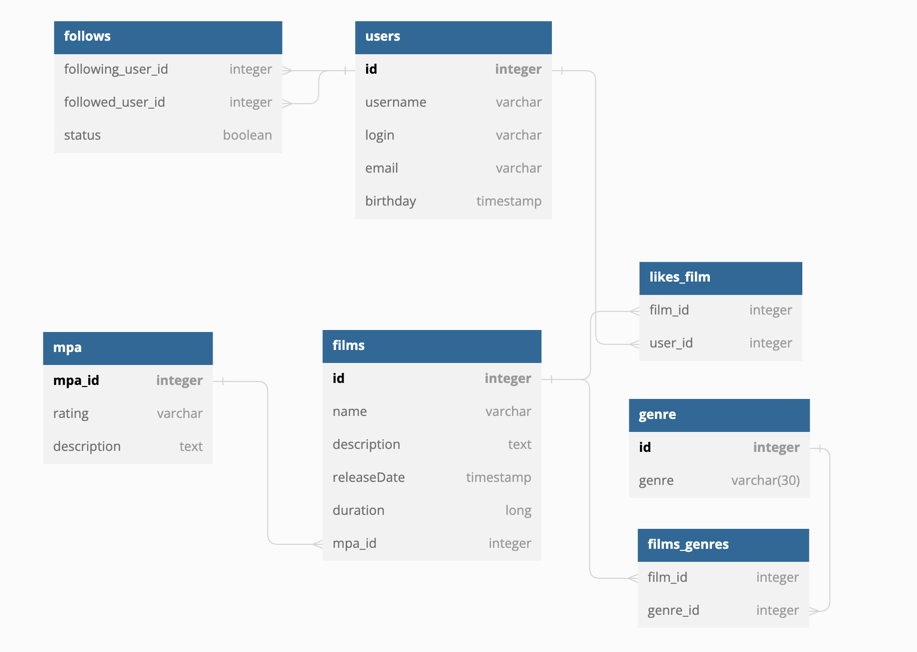

# java-filmorate
Template repository for Filmorate project.

# scheme-database-filmorate

- users - хранит польвателей,
- follows - хранит дружеские связа пользователей, поле 
    status может принимать значение [false,true], где true-confirmed, в случае
    если followed_user_id принял заявку на дружбу от following_user_id,
- films - хранит фильмы,
- mpa - хранит рейтинг Ассоциации кинокомпаний (англ. Motion Picture Association, сокращённо МРА). Эта оценка определяет возрастное ограничение для фильма. Значения могут быть следующими:
  G — у фильма нет возрастных ограничений,
  PG — детям рекомендуется смотреть фильм с родителями,
  PG-13 — детям до 13 лет просмотр не желателен,
  R — лицам до 17 лет просматривать фильм можно только в присутствии взрослого,
  NC-17 — лицам до 18 лет просмотр запрещён.
- genre - хранит жанры фильмов,
- likes_film - хранит лайки польвателей к фильму,
- films_genres - хранит жанры фильмов
